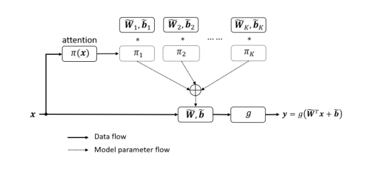
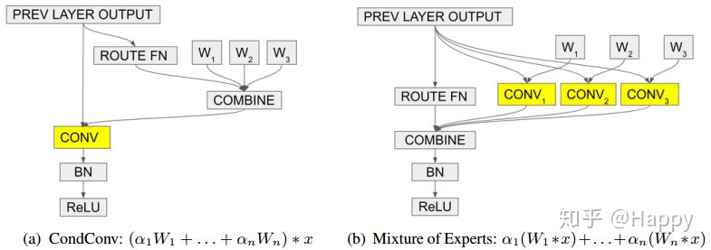

# 动态卷积

## dynamic conv
动态卷积，提出的目的是卷积只与之前的数据相关，所以当出现新的数据时候，依赖之前的数据经验，而不是当前的数据，所以动态卷积理论上，可以理解为对于不同的数据，依赖注意力机制权重，可以选择较为适合的卷积。与数据产生联系通过输入x。然后在分配不同的权重到卷积内，这样选择不同的卷积很方便。

## condconv
比上面早Google提出的，类似于多个专家来判断CondConv等价于多个静态卷积的线性组合。

