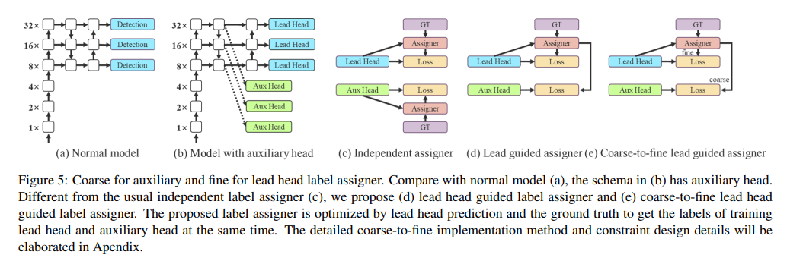

---
code:https://github.com/WongKinYiu/yolov7
paper:https://arxiv.org/pdf/2207.02696.pdf
---

auxiliary_head在文章里的描述为一种残差结构（generalized residual learning）

正常的残差思路是out=x+f(x).而auxiliary所做则是在backbone之后，和输出之前对目标进行一次loss测算。而yolov7里面所提出的则是一个更加精细的过程，里面重要的trick则是soft label。我们平时训练都是直接gt进行训练，而soft label则像一个不精准的gt。简单来说，soft label范围更大，优化前面的过程，让网络很容易找到模糊区域，再到后面由头部自己精细的寻找更仔细的区域，很厉害的想法。